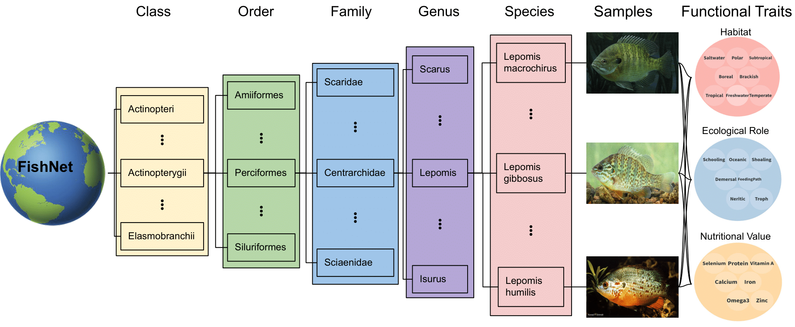

# FishNet: A Large-scale Dataset and Benchmark for Fish Recognition, Detection, and Functional Traits Prediction(ICCV 2023)

[Faizan Farooq Khan](https://faixan-khan.github.io/), [Xiang Li](https://xiangli.ac.cn/), [Andrew Temple](https://reefecology.kaust.edu.sa/people/details/andrew-temple),  and [Mohamed Elhoseiny](https://www.mohamed-elhoseiny.com/). 

## Introduction

We present FishNet, a comprehensive benchmark for large-scale aquatic species recognition, detection, and functional trait identification. Our benchmark dataset is based on an aquatic biological taxonomy, consisting of 8 taxonomic classes, 83 orders, 463 families, 3,826 genera, 17,357 species, and 94,532 images. The dataset also includes bounding box annotations for fish detection. Additionally, the dataset encompasses 22 traits, grouped into three categories: habitat, ecological rule, and nutritional value. These traits facilitate the identification of the ecological roles of aquatic species and their interactions with other species.

## Dataset Download

To download the required files, follow these steps:

1. **Image Files:**
   All the images can be found [here.](https://drive.google.com/file/d/1mqLoap9QIVGYaPJ7T_KSBfLxJOg2yFY3/view?usp=sharing)

3. **Detection Annotation Files:**
   Download bbox.zip file for detection annotations. The annotations are in the [KITTI](https://www.cvlibs.net/datasets/kitti/eval_object.php?obj_benchmark=3d) dataset format.
   Please refer to the [tutorial](https://github.com/xy-guo/mmdetection_kitti/blob/dev/demo/MMDet_Tutorial.ipynb) for getting started.
2. **Classification and Traits Annotation Files:**
   [TODO]

